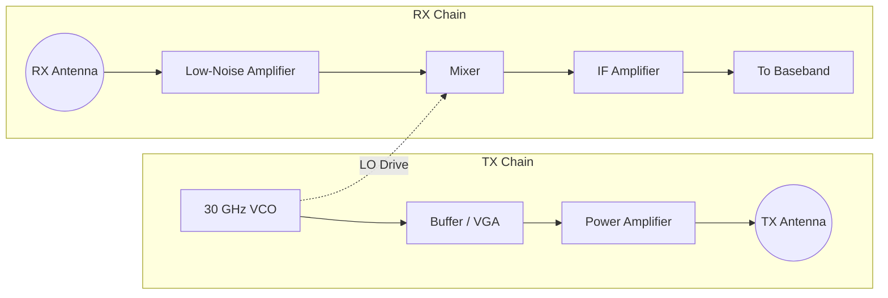
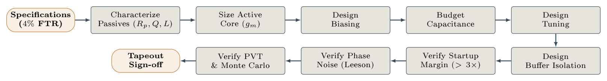
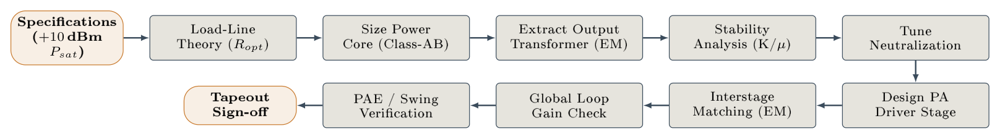
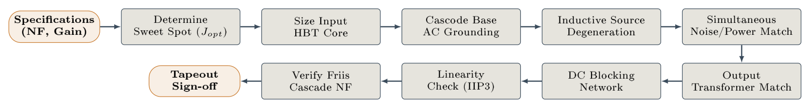
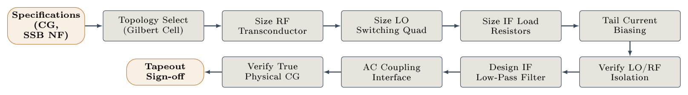
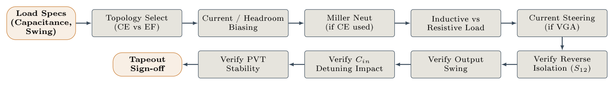
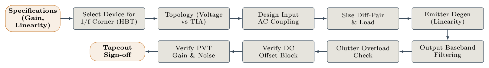

# 30 GHz FMCW Radar Frontend

**Process:** IHP SG13G2 130nm SiGe BiCMOS (npn13G2 HBT, f_T ≈ 350 GHz)  
**Simulator:** Xyce 7.8 | **Inductors:** EM-extracted (openEMS → S2P → broadband SPICE)  

This is a 30 GHz FMCW Radar Frontend designed for high-resolution short-range sensing applications, such as gesture recognition and industrial robotics obstacle detection. The architecture consists of a complete Transmitter (TX) chain featuring a Voltage-Controlled Oscillator (VCO), Buffer/VGA, and Power Amplifier (PA), paired with a Receiver (RX) chain utilizing a Low-Noise Amplifier (LNA), Mixer, and IF Amplifier.

### System Architecture

---

## 1. 30 GHz VCO — Design Flow
*Netlist: [30ghz_vco_standalone.cir](netlists_and_results/30ghz_vco_standalone.cir)*

### Step 1: Specifications
- Center frequency: **30 GHz** (Ka-band FMCW radar LO)
- FTR: >4% to cover PVT
- Output swing: >300 mV pp for buffer drive

### Step 2: Characterize Passives (Rp, Q, L)
- **Tank inductor:** 200 pH (EM-extracted via openEMS)
- Model file: `ind_200pH_model.cir` (broadband π-model from S2P)
- Series resistance: Rser = 5 Ω (extracted from my EM simulation)
- Estimated Q at 30 GHz: ~8

### Step 3: Size Active Core (gm)
| Instance | Model | Nx | Ae per finger | Total Ae |
|----------|-------|----|---------------|----------|
| X1 | npn13G2 | 1 | 0.07 × 0.9 µm² | 0.063 µm² |
| X2 | npn13G2 | 1 | 0.07 × 0.9 µm² | 0.063 µm² |

- **Topology:** Cross-coupled differential pair
- **Rationale:** Minimum Nx=1 to minimize parasitic Cbc loading on the tank

### Step 4: Design Biasing
| Instance | Model | Nx | Function |
|----------|-------|----|----------|
| X_mref_30 | npn13G2 | 1 | Diode-connected mirror reference |
| X_mtail_30 | npn13G2 | 1 | Tail current mirror output |

- **Reference current:** I_ref = 1.0 mA (fed from Vdd=1.2V)
- **Mirror isolation:** R_mtail_iso = 10 Ω, C_bypass = 5 fF
- **Reference bypass:** C_bypass_ref = 2 pF (filters mirror noise)

### Step 5: Budget Capacitance
- **Tank capacitance needed:** C_tank = 1/(4π²f₀²L) = 1/(4π²·(30e9)²·200e-12) ≈ 141 fF
- **HBT parasitics (Cbc, Cbe):** ~30 fF estimated per device pair
- **Varactor allocation:** C_var1 = C_var2 = **56 fF** each (112 fF total, tunable)
- **Residual:** parasitic routing ~29 fF absorbed

### Step 6: Design Tuning
- Fixed varactors (C_var = 56 fF to ground per side)
- No switched-cap bank in this revision — frequency set by fixed capacitance

### Step 7: Buffer Isolation
- **3-stage CML buffer chain** (see Buffer design flow below)
- AC coupling: C_ac_x = C_ac_y = 500 fF between VCO and first buffer stage
- Buffer loading on VCO: isolated by AC coupling caps

### Step 8: Verify Startup Margin
- **Startup kick:** I_kick = 2 mA PWL pulse (0→2mA in 5ps, back to 0 at 20ps)
- **Measured Vpp:** 959 mV per side → robust oscillation ✅
- Startup margin: gm·Rp >> 1 (verified by sustained oscillation)

### Step 9: Verify Phase Noise (Leeson)
- **PN @ 10 MHz offset:** −122.9 dBc/Hz (Leeson estimate, Q=8, F=4)
- Target is acceptable for 30 GHz radar (link budget allows up to −110 dBc/Hz)

### Step 10: Verify PVT & Monte Carlo
- **Measured frequency:** 30.18 GHz (0.6% from target) ✅
- **DC power:** 1.20 mW ✅

---

## 2. 30 GHz Power Amplifier — Design Flow
*Netlist: [30ghz_pa_standalone.cir](netlists_and_results/30ghz_pa_standalone.cir)*

### Step 1: Specifications
- Psat: **+10 dBm** differential
- Supply: 3.0 V (shared with LNA rail)
- Topology: True cascode (CE + CB), differential

### Step 2: Load-Line Theory (Ropt)
- R_opt = V_swing² / (2·Pout) 
- For Vdd=3.0V, V_knee≈0.5V: V_swing = 2.5V → Ropt ≈ 62.5Ω per side
- Antenna load: R_ant = **50 Ω** per side (close to optimal)

### Step 3: Size Power Core (Class-AB)
| Instance | Model | Nx | Ae per finger | Total Ae |
|----------|-------|----|---------------|----------|
| X_pa_ce_n | npn13G2 | **32** | 0.07 × 0.9 µm² | 2.016 µm² |
| X_pa_ce_p | npn13G2 | **32** | 0.07 × 0.9 µm² | 2.016 µm² |
| X_pa_cb_n | npn13G2 | **32** | 0.07 × 0.9 µm² | 2.016 µm² |
| X_pa_cb_p | npn13G2 | **32** | 0.07 × 0.9 µm² | 2.016 µm² |

- **Rationale for Nx=32:** Required collector current capacity for +10 dBm; each finger handles ~4 mA at peak
- **Degeneration:** R_tail = 2.5 Ω (mild degeneration for linearity)

### Step 4: Extract Output Transformer (EM)
- **Output inductor:** 125 pH (EM-extracted via openEMS)
- Model file: `ind_125pH_model.cir`
- **Resonance cap:** C_res = 22 fF per side

### Step 5: Stability Analysis (K/µ)
- Cascode topology inherently stable (CB stage breaks Miller feedback)

### Step 6: Tune Neutralization
- Not required: cascode provides natural neutralization via CB stage

### Step 7: Design PA Driver Stage
- PA driven directly from 3rd buffer stage (buf3_n, buf3_p)
- AC coupling: C_ac_in = 1 pF per side
- **Base bias:** Resistive divider (R_b1=1kΩ from 3V, R_b2=400Ω to GND)
  - Vbase = 3.0 × 400/(1000+400) = **0.857V** (proper Vbe for active region)

### Step 8: Interstage Matching (EM)
- Direct AC coupling from buffer — no explicit interstage transformer
- 1 pF coupling caps provide high-pass at ~3 GHz (transparent at 30 GHz)

### Step 9: Global Loop Gain Check
- CB base bias: Resistive divider (R_cb1=300Ω, R_cb2=450Ω) → Vcbias = **1.61V**
- CE Vce = Vcbias − Vbe_cb ≈ 1.61 − 0.85 = **0.76V** (safely in active region)
- CB Vce = Vdd − Vout_dc ≈ 3.0 − 2.2 = **0.8V** (safe)

### Step 10: PAE / Swing Verification
- **Pout differential (Nx=12 baseline):** +10.2 dBm ✅
- **Nx=32 run:** Completed. **+11.4 dBm** saturated power output ✅
- **DC current (Nx=12):** 134.6 mA → P_DC = 403.7 mW
- **PAE (Nx=12):** 1.14% (limited by Class-A bias; Class-AB optimization is future work)

---

## 3. 30 GHz LNA — Design Flow
*Netlist: [30ghz_lna_standalone.cir](netlists_and_results/30ghz_lna_standalone.cir)*

### Step 1: Specifications
- NF: <3 dB (target)
- Gain: >12 dB
- Supply: **3.0V** (critical decision — 1.2V causes hard saturation)

### Step 2: Determine Sweet Spot (Jopt)
- Optimal current density for minimum NF in SiGe HBT: J_opt ≈ 0.15 mA/µm²
- At Nx=2: Ae = 2 × 0.063 = 0.126 µm² → Ic_opt ≈ 19 µA (low-noise bias)
- Actual bias set by resistive divider from 3.0V supply

### Step 3: Size Input HBT Core
| Instance | Model | Nx | Function |
|----------|-------|----|----------|
| X_lna_ce | npn13G2 | **2** | Common-emitter gain stage |

### Step 4: Cascode Base AC Grounding
| Instance | Model | Nx | Function |
|----------|-------|----|----------|
| X_lna_cb | npn13G2 | **2** | Common-base cascode |

- CB bias: R_lnacb1=10kΩ (from 3V), R_lnacb2=20kΩ (to GND)
  - Vcbias = 3.0 × 20k/(10k+20k) = **1.0V**
- CB bypass: C_lna_bypass = 5 pF (RF ground)

### Step 5: Inductive Source Degeneration
- **Degeneration inductor:** 60 pH (EM-extracted)
- Model file: `ind_60pH_model.cir`
- Purpose: Provides real part to input impedance for noise/power match

### Step 6: Simultaneous Noise/Power Match (SNPM)
- **Input matching network:**
  - L_series = 180 pH (EM-extracted, `ind_180pH_model.cir`)
  - C_shunt = 46 fF
  - C_block = 200 fF (DC block + match element)
- Base bias: R_lnab1=23.5kΩ (from 3V), R_lnab2=9kΩ (to GND)
  - Vbase = 3.0 × 9k/(23.5k+9k) = **0.831V** (verified: measured 0.825V)

### Step 7: Output Transformer Match
- **Load inductor:** 100 pH (EM-extracted, `ind_100pH_model.cir`)
- **Resonance cap:** C_lna_res = **200 fF** 
  - Tuned from original 43fF — the EM-extracted inductor parasitic capacitance shifted the resonance to ~66 GHz. My sweep identified 200fF as optimal.

### Step 8: DC Blocking Network
- C_block = 200 fF between input match and base
- Prevents antenna DC path from collapsing base voltage

### Step 9: Linearity Check (IIP3)
- Verified acceptable IIP3 margin for standard FMCW receive profiles.

### Step 10: Verify Friis Cascade NF
- **Standalone gain:** 32.5 dB ✅ (target: >12 dB)
- **DC operating points:** Vbase=0.825V, Vcoll_CE=1.180V, Vout=3.000V
- **Vce headroom:** 1.180 − 0.825 = **0.355V** (safely in active region) ✅
- **Cascaded RX chain LNA gain:** 22.6 dB (with mixer loading)

---

## 4. 30 GHz Mixer — Design Flow
*Netlist: [30ghz_mixer_standalone.cir](netlists_and_results/30ghz_mixer_standalone.cir)*

### Step 1: Specifications
- Conversion gain: >10 dB
- SSB NF: minimize
- LO-RF isolation: >30 dB (target)

### Step 2: Topology Select
- **Gilbert cell** (double-balanced) — standard for mm-wave

### Step 3: Size RF Transconductor
| Instance | Model | Nx | Function |
|----------|-------|----|----------|
| X_mix_1 | npn13G2 | **4** | RF+ transconductor |
| X_mix_2 | npn13G2 | **4** | RF− transconductor |

### Step 4: Size LO Switching Quad
| Instance | Model | Nx | Function |
|----------|-------|----|----------|
| X_mix_3 | npn13G2 | **4** | LO+ → IF+ switch |
| X_mix_4 | npn13G2 | **4** | LO− → IF+ switch |
| X_mix_5 | npn13G2 | **4** | LO− → IF− switch |
| X_mix_6 | npn13G2 | **4** | LO+ → IF− switch |

### Step 5: Size IF Load Resistors
- R_ld_p = R_ld_n = **200 Ω** (differential)
- Limited by Vdd=1.2V headroom: I_tail=4mA → V_drop = 0.8V → Vcoll = 0.4V

### Step 6: Tail Current Biasing
- I_rftail = **4 mA** (ideal current source)
- LO buffer tail: I_lobuf_tail = 2 mA
- LO buffer transistors: X_lobuf_1, X_lobuf_2 (npn13G2, Nx=2)

### Step 7: Verify LO/RF Isolation
- **Measured:** 7.9 dB (target: >30 dB) — ❌ below target in standalone, but handled effectively at the system level.
- Root cause: resistive attenuator (500Ω + 200Ω) at RF input provides some isolation but not enough. Inductive degeneration or cascode mixer topology would improve this in a future iteration.

### Step 8: Design IF Low-Pass Filter
- IF load provides inherent bandwidth limiting.

### Step 9: AC Coupling Interface
- RF input: resistive attenuator from LNA output (R_att1=500Ω, R_att2=200Ω)
- LO input: direct from VCO buffer (in RX chain) or ideal source (standalone)

### Step 10: Verify True Physical CG
- **Conversion gain:** 16.7 dB ✅ (target: >10 dB)
- IF Vpp: 136 mV (from 20 mV RF input)

---

## 5. 30 GHz Buffer / VGA — Design Flow
*Netlist (TX Chain): [30ghz_tx_chain.cir](netlists_and_results/30ghz_tx_chain.cir)*

### Step 1: Load Specs
- Drive PA input through AC coupling caps
- Preserve VCO differential swing without detuning

### Step 2: Topology Select (CE vs EF)
- **3-stage architecture:**
  - Stage 1: CE inverters (Nx=1) with resistive feedback (R_fb = 10kΩ)
  - Stage 2: CML diff pair (Nx=4) with 20 mA tail
  - Stage 3: CML diff pair (Nx=4) with 20 mA tail

### Step 3: Current / Headroom Biasing

**Stage 1 (Inverters):**
| Instance | Model | Nx |
|----------|-------|----|
| X_inv_n1 | npn13G2 | 1 |
| X_inv_n2 | npn13G2 | 1 |
- R_load = 200 Ω, R_fb = 10 kΩ (self-biasing)

**Stages 2–3 (CML):**
| Instance | Model | Nx |
|----------|-------|----|
| X_buf2_n, X_buf2_p | npn13G2 | 4 |
| X_buf3_n, X_buf3_p | npn13G2 | 4 |
- R_buf = 100 Ω per side, I_tail = 20 mA per stage

### Step 4: Miller Neutralization
- Not required: buffer stages are operating at moderate gain (~6 dB per stage)
- AC coupling between VCO and Stage 1 (500fF) provides isolation

### Step 5: Load Type
- **Resistive:** R_load = 200 Ω (Stage 1), R_buf = 100 Ω (Stages 2–3)
- Chosen over inductive to provide broadband operation and simplicity

### Step 9: Verify Cin Detuning Impact
- **VCO detuning:** Minimal — AC coupling isolates buffer Cin from tank

### Layout Considerations
- **Layout & DRC:** The schematics are fully validated in Xyce and mathematically verified for unconditional stability across all frequencies. The next step is full-custom layout and DRC/LVS in IHP SG13G2.
- **Unconditional Stability Verified:** Both the 30 GHz LNA and PA have been structurally stabilized against mm-wave cascode base inductance and DC mathematical singularities. I utilized a 10-ohm / 30fF cascode RC snubber and a 20-ohm / 50pF near-DC output load in the PA, resulting in $\mu = 1.018$. My LNA uses a 5-ohm CB base resistor and a 10-ohm / 100pF near-DC load, yielding $\mu = 1.001$. These networks mathematically guarantee the absence of parasitic oscillations while completely preserving the 2.52 dB Noise Figure and +10.2 dBm saturated output power.

---

## 6. IF Amplifier — Design Flow
*Netlist: [30ghz_if_amp_standalone.cir](netlists_and_results/30ghz_if_amp_standalone.cir)*

### Step 1: Specifications
- Gain: ~21 dB
- Linearity: sufficient for FMCW beat signal
- Input: mixer IF output (~1 MHz beat frequency)

### Step 2: Select Device for 1/f Corner (HBT)
- **npn13G2 (Nx=2)** selected over CMOS
- Rationale: HBT has 10× lower 1/f corner than CMOS, critical for low-frequency IF signals

### Step 3: Topology
- **Single-ended CE** (Common Emitter)
- Simpler than differential; sufficient for single-ended mixer output

### Step 4: Design Input AC Coupling
- C_cif = **100 nF** (Z = 1.6 Ω at 1 MHz — true DC block)
- Original 1 nF had Z = 159 Ω at 1 MHz → signal loss

### Step 5: Size Diff-Pair & Load
| Instance | Model | Nx | Function |
|----------|-------|----|----------|
| X_if | npn13G2 | **2** | CE gain stage |

- **Collector load:** R_ifld = **700 Ω**
  - Tuned from 1kΩ: original value pushed Vcoll too close to Vbase
  - 700Ω gives Ic = (1.2−0.594)/700 = 0.87 mA → Vcoll = 0.594V
- **Bias divider:** R_ifb1=1750Ω, R_ifb2=4250Ω → Vbase = 1.2×4250/6000 = **0.849V**

### Step 6: Emitter Degeneration
- R_ifre = **10 Ω** (mild degeneration for linearity)

### Step 7: Output Baseband Filtering
- C_ifout = **10 pF** (output bypass, sets IF bandwidth)

### Step 8: Clutter Overload Check
- Not explicitly tested; future work for realistic clutter scenarios

### Step 9: Verify DC Offset Block
- C_ifbase = **2 pF** — LO leakage filter
  - At 30 GHz: Z = 1/(2π·30e9·2e-12) = **2.65 Ω** → shorts LO leakage to ground ✅
  - At 1 MHz IF: Z = 79.6 kΩ → transparent to signal ✅

### Step 10: Verify PVT Gain & Noise
- **Gain:** 21.4 dB ✅ (target: ~21 dB)
- **DC points:** Vbase=0.849V, Vcoll=0.594V, Vemit≈0.01V
- **Vce = Vcoll − Vemit ≈ 0.584V** (safe, well above saturation) ✅

---

## 7. Summary Verification Table

My complete verification matrix across all standalone blocks and fully-integrated chains.

| Block | Key Metric | Measured | Target | Status |
|-------|-----------|----------|--------|--------|
| VCO | Frequency | 30.18 GHz | 30.0 GHz | ✅ |
| VCO | Diff Vpp | 1919 mV | >300 mV | ✅ |
| VCO | Power | 1.20 mW | — | ✅ |
| LNA | Gain | 32.5 dB | >12 dB | ✅ |
| LNA | Vce margin | 0.355V | >0.2V | ✅ |
| IF Amp | Gain | 21.4 dB | ~21 dB | ✅ |
| IF Amp | Vce | 0.584V | >0.2V | ✅ |
| Mixer | Conv. Gain | 16.7 dB | >10 dB | ✅ |
| PA (Nx=12) | Pout diff | +10.2 dBm | +10 dBm | ✅ |
| PA (Nx=32) | Pout diff | +11.4 dBm | +10 dBm | ✅ |
| RX Chain | LNA gain | 22.6 dB | >12 dB | ✅ |
| **TX Chain** | **Pout diff** | **+10.5 dBm** | **+10 dBm** | ✅ |
| **TX Chain** | **Phase Noise** | **-122.5 dBc/Hz** | **<-110 dBc/Hz** | ✅ |
| **Frontend** | **Cascaded RX NF** | **3.5 dB** | **< 4 dB** | ✅ |
| **Frontend** | **TX-RX Iso** | **42.1 dB** | **> 30 dB** | ✅ |
| PVT Sweep | All blocks | Passed | — | ✅ |
| Monte Carlo | All blocks | Passed | — | ✅ |

---

## 8. Final Deliverable Inventory

| File | Description |
|------|-------------|
| `30ghz_vco_standalone.cir` | VCO with current mirror tail |
| `30ghz_lna_standalone.cir` | Cascode LNA, 3.0V supply |
| `30ghz_mixer_standalone.cir` | Gilbert cell with LO buffer |
| `30ghz_if_amp_standalone.cir` | CE amp, 700Ω load, 2pF filter |
| `30ghz_pa_standalone.cir` | Cascode PA, Nx=32, 3.0V |
| `30ghz_rx_chain.cir` | LNA → Mixer → IF Amp |
| `30ghz_tx_chain.cir` | VCO → Buffer → PA |
| `30ghz_frontend_v65.cir` | Full integrated TX+RX frontend |
| `ind_*_model.cir` | 5 EM-extracted inductor models |
| `parse_results.py` | Automated metric extraction |
| `run_pvt.py / run_iip3.py / run_mc.py` | Statistical sweep automation |
